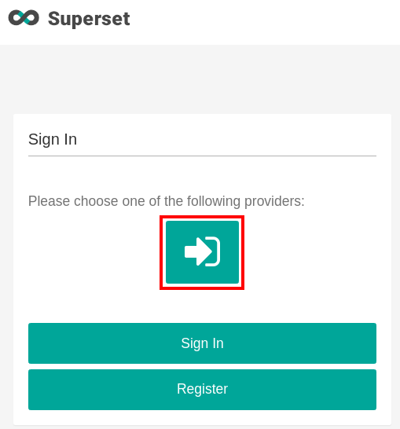

# OpenLMIS Reporting Stack

## Deploying to a Server
1. *Prerequisite:* You should first [deploy OpenLMIS](../README.md). OpenLMIS and the reporting stack must run on separate (virtual) machines. Your OpenLMIS instance should have HTTPS enabled to connect to the reporting stack.

2. *Prerequisite:* You should have a server with two domain names pointing to it, one for Superset and one for NiFi (e.g. `nifi.foo.openlmis.org` and `superset.foo.openlmis.org`). Ports 80 and 443 should be open on the server.

3. Configure OpenLMIS to authenticate with the reporting stack's components. If your OpenLMIS instance is using the `demo-data` spring profile, this is already setup.
  You need two users in OpenLMIS: one for Superset and one for NiFi. The instructions below describe how to set up these users ("OAuth User for Superset" and "OpenLMIS user with all permissions for Superset").

4. From this directory (`openlmis-ref-distro/reporting/`) on the server, copy and configure your settings.
  ```
  $ cp settings-sample.env settings.env
  ```
  * Edit `settings.env` to match your setup. Despite generating the passwords, you will likely need to change
   `VIRTUAL_HOST`, `TRUSTED_HOSTNAME`, `OL_BASE_URL` (to point to OpenLMIS) and `NIFI_DOMAIN_NAME` and `SUPERSET_DOMAIN_NAME` (which should point to the reporting stack).
  Details on all the environment variables are below.

5. Bring up the reporting stack by running [docker-compose](https://docs.docker.com/compose/) on the server:
  ```sh
  docker-compose up --build -d
  ```
  * You might, at times, want to take down the stack including all the created volumes. We recommend you do this if you ever change configurations in either the [./db](./db) or [./config](./config) directories:

  ```sh
  docker-compose down -v
  ```

6. The Superset webapp should now be running on your server. From your local browser, navigate to your Superset domain. You should be presented with a sign-in screen:
  

7. Click the arrow (outlined in red above) to select OpenLMIS OAuth provider. Then, click the "Sign In" button. Enter the credentials for your OpenLMIS user for Superset. On the next page, approve all the requested permissions. Now, when you navigate to the Superset domain, a dashboard should populate with data from your OpenLMIS instance.

8.  If you have an OpenLMIS user with the proper permissions, you can also log in to OpenLMIS and navigate to `https://<OpenLMIS Domain>/#!/reports/list` and then select a report that uses the reporting stack (e.g. stockouts) to access Superset from OpenLMIS. This will require authorizing Superset by following the on-screen instructions.

9. You should be able to access NiFi by navigating to the `NIFI_DOMAIN_NAME`, if you set it up.

## Upgrading Superset to a new version

Upgrading Superset to new version consist of two steps:
1. Updating configuration volume with latest Superset configuration and customization files.
1. Building and starting a new Docker image with the upgraded version.

##### Updating configuration volume

The `./upgrade-superset-config.sh` script can be used to update the configuration volume in one go. 
It must be executed on the Superset's Docker host system. 
The scripts starts a 'dummy' container linked ot the config volume, and copies (with override) the new content
of `./config/services/superset`.

##### Running new Docker image

There are no special considerations. 
Start and build the Docker image included in this project as described in **Deploying to a Server** section.

## OAuth User for Superset

In order to use user authentication in Superset by an OpenLMIS instance we need to create additional user in OpenLMIS.
It is the specific user with `authorizedGrantTypes` set to `authorization_code`

Example of a SQL statement creating that user (superset:changeme):
```
INSERT INTO auth.oauth_client_details (clientId,authorities,authorizedGrantTypes,clientSecret,"scope")
VALUES ('superset','TRUSTED_CLIENT','authorization_code','changeme','read,write');
```

Don't forget to set newly created user's credentials in settings.env. Example:
```
OL_SUPERSET_USER=superset
OL_SUPERSET_PASSWORD=changeme
```

## OpenLMIS user with all permissions for Superset

The ETL process conducted via NiFi requires a user which has all permissions (all program + supervisory node pairs) to read data from all requisitions in the system. It should not be a simple admin, because sometime it doesn't has all permissions (eg. for requisitions)

The simplest way to create that user is using the https://github.com/OpenLMIS/openlmis-refdata-seed tool.

Note: Created user must have an email address.


Don't forget to set newly created user's credentials in settings.env. Example:
```
OL_ADMIN_USERNAME=administrator
OL_ADMIN_PASSWORD=password
```

## Environment variables

The environment variables in `settings.env` have to be set to successfully run the reporting stack.
The sample settings file can be found [here](settings-sample.env). The sample file contains description of each field.

## Running Locally

* While it is possible to run the reporting stack locally, it is not entirely supported, and you cannot run both the reporting stack and OpenLMIS locally at the same time.
* It's easiest to access superset and nifi by leaving `.env` alone, and adding
    entries to our host's `/etc/hosts` file:
    ```
    127.0.0.1   nifi.local superset.local
    ```

### Running Setup Without Scalyr

There are some cases (when running on a dev machine, for instance) where you would prefer to spin-up the stack without the Scalyr container running. To do that, run docker-compose this way:

```sh
docker-compose up --build -d --scale scalyr=0
```

## Syncronization / Replication

This stack uses Debezium and Kafka-Connect with Postgres connectors to replicate
the data (using Change Data Capture) from the OpenLMIS instance, to this
reporting stack.

Operationally this means:
- The first time the stack is started, it must snapshot all of the data in
  OpenLMIS, and transfer it here.  This takes awhile - possibly days for large
  data sets.
- If the stack is destroyed (as in the database deleted, or the volumes of
  kafka or debezium deleted), then the replication between OpenLMIS and this
  stack must be removed in the OpenLMIS side.
- If this stack becomes unavailable to OpenLMIS, the OpenLMIS db server will
  accumulate WAL segments, and quickly use disk storage.  This normally rectifies
  itself once this stack is made available again to OpenLMIS.  However it's
  possible that this doesn't happen in time, and the OpenLMIS server will run
  out of disk space.  In this case the replication slots need to be manually
  removed.

### Removing replication slots in OpenLMIS

The replication slots in OpenLMIS are automatically created by this stack upon
first connection.  These replication slots will need to be removed in certain
cases.  If this is done, then the replication progress between OpenLMIS and
this stack will be broken, and a new connection + snapshotting will likely need
to occur before operation can resume.

To remove:

1. obtain a PSQL connection to the OpenLMIS database.
    ```shell
    docker exec -it openlmis-db-1 psql -U postgres open_lmis
    ```
1. Show replications slots:
    ```sql
    select slot_name from pg_replication_slots;
    
    slot_name
    -------------------
    dbz_referencedata
    dbz_requisition
    ```
  1. Remove the slots:
      ```sql
      select pg_drop_replication_slot('dbz_referencedata');
      select pg_drop_replication_slot('dbz_requisition');
      ```
## CI/CD

### KEEP_OR_WIPE

Is an environment variable that when set to `wipe` will be destructive.

- `keep`: (default if not specified), does not delete database or volumes,
  except for the config volume, which needs to be removed to allow for configuration
  changes.
- `wipe`: **destructive**, will delete db and all volumes.  If set the 
  [syncronization](#syncronization--replication) process will need to be restarted.